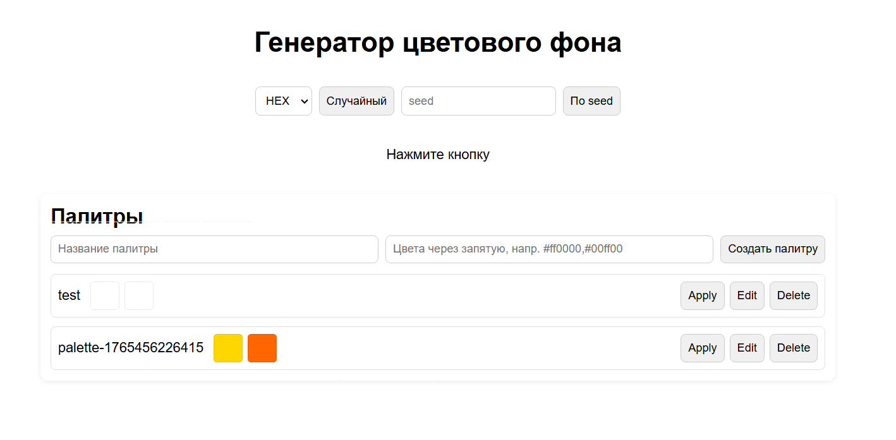
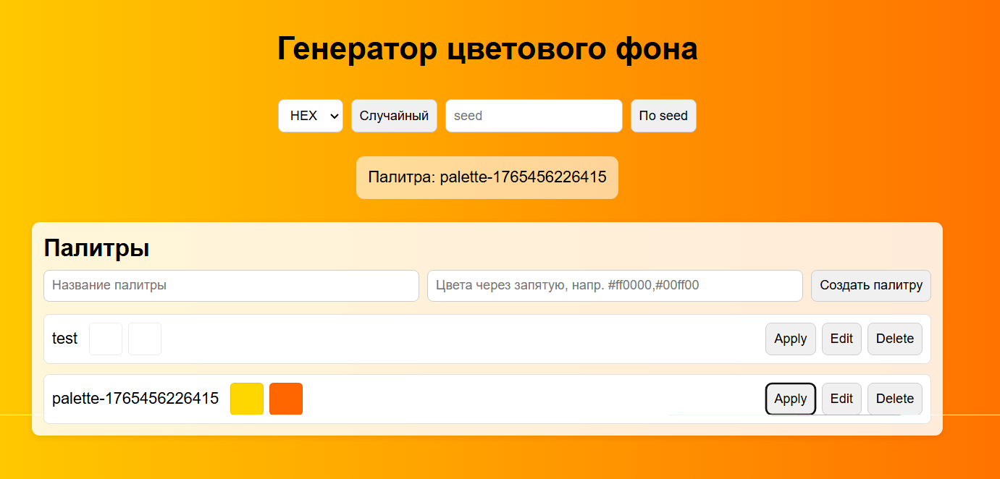

### Описание проекта

Простое Express-приложение для генерации случайных и детерминированных цветов, а также управления палитрами.
Проект включает маршруты, контроллеры, middleware, работу с параметрами, телом запроса и раздачу статических файлов.

### Функционал

- Генерация случайного цвета (HEX, RGB, HSL)

- Генерация детерминированного цвета по seed

- CRUD для палитр

- Статическая веб-страница с интерфейсом


## Запуск
### Клонируйте репозиторий

```bash
git clone https://github.com/Eeegggooorrr1/tip_kr_5
```

### Перейдите в папку проекта

```bash
cd tip_kr5
```

### Установите зависимости

```bash
npm install
```

### Запустите локальный сервер

```bash
npm run dev
```

## Скриншоты



